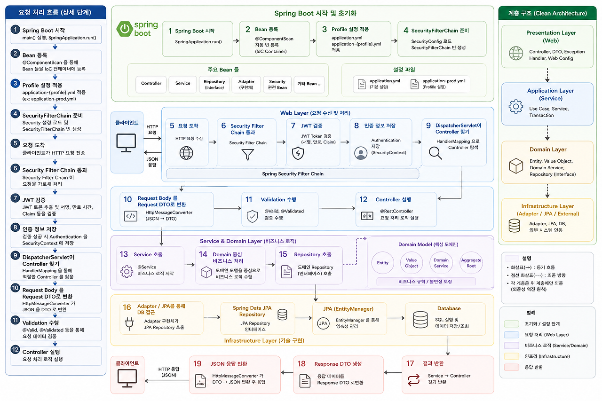
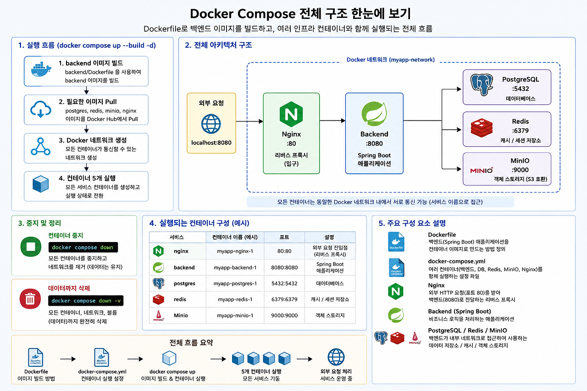
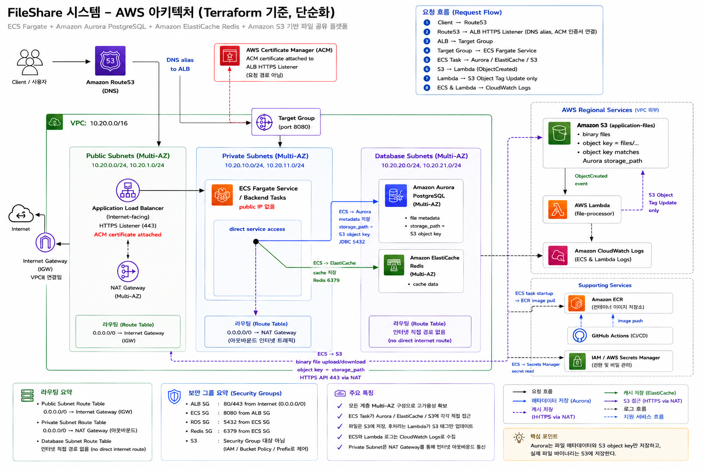

# 08. Portfolio

## 프로젝트 한 줄 소개

Spring Boot 기반 파일 공유 API를 Docker Compose 온프레미스 환경에서 먼저 완성하고, 동일한 API/데이터 계약을 유지한 채 AWS ECS Fargate, Aurora PostgreSQL, ElastiCache Redis, S3, Lambda 기반 구조로 전환한 마이그레이션 프로젝트다.

## 대표 아키텍처 자료

### Spring Boot 요청 처리와 계층 구조



이 다이어그램은 요청이 Spring Boot 애플리케이션에 들어온 뒤 인증, Controller, Service/Domain, Repository/JPA, Database, Response DTO 변환을 거쳐 응답으로 반환되는 흐름을 설명한다.

포트폴리오에서 강조할 점:

- `SecurityFilterChain`과 JWT 검증을 통해 인증 책임을 분리했다.
- Controller는 HTTP 계약, Service는 비즈니스 로직, Domain은 핵심 규칙, Infrastructure는 외부 시스템 연동을 담당한다.
- 저장소 구현을 interface 뒤에 두어 MinIO에서 S3로 바뀌어도 API 계층의 계약을 유지할 수 있다.

### Docker Compose 온프레미스 구조



온프레미스 기준으로는 Nginx, Backend, PostgreSQL, Redis, MinIO를 하나의 Docker Compose 네트워크에서 실행한다.

역할:

- Nginx: 외부 요청 진입점과 reverse proxy
- Backend: Spring Boot API, 인증/인가, 파일 메타데이터 처리
- PostgreSQL: 사용자와 파일 메타데이터 저장
- Redis: 파일 단건 메타데이터 캐시
- MinIO: 실제 파일 바이너리 저장

이 구조는 AWS 전환 전의 기능 검증 기준이다. 온프레미스에서 검증한 API 응답 형식, DB schema, Redis cache key, object key를 AWS에서도 유지하는 것이 마이그레이션의 핵심이다.

### AWS 아키텍처



AWS 구조는 subnet 계층과 managed service 책임을 분리해서 설계했다.

```text
Client
  -> Route53
  -> ALB HTTPS Listener
  -> ECS Fargate Backend
      -> Aurora PostgreSQL
      -> ElastiCache Redis
      -> Amazon S3
  -> S3 ObjectCreated Event
  -> Lambda file processor
  -> CloudWatch Logs / Alarms
```

핵심 설명:

- ALB는 public subnet에 있고, ECS task는 private subnet에서 public IP 없이 실행된다.
- Aurora PostgreSQL과 ElastiCache Redis는 database subnet에 둔다.
- S3, Lambda, CloudWatch는 subnet 안에 배치하는 리소스가 아니라 AWS regional service로 표현한다.
- 현재 Terraform 기준 S3 VPC Endpoint가 없으므로 ECS는 NAT Gateway를 통해 S3 HTTPS API를 호출한다.
- S3 접근 제어는 security group이 아니라 IAM, bucket policy, object prefix 기준으로 한다.

## 파일 저장 설계

파일 업로드 시 데이터는 역할에 따라 나뉘어 저장된다.

| 저장소 | 저장 데이터 |
| --- | --- |
| Aurora PostgreSQL | 파일 ID, 소유자, 원본 파일명, 크기, content type, `storage_path`, 상태 |
| ElastiCache Redis | `files:metadata:{fileId}` 형식의 조회용 메타데이터 캐시 |
| Amazon S3 | 실제 파일 바이너리와 object tag |

중요한 점은 Aurora나 ElastiCache를 거쳐 S3에 저장되는 구조가 아니라는 것이다.

```text
ECS Backend
  -> Aurora PostgreSQL: metadata 저장, storage_path = S3 object key
  -> ElastiCache Redis: cache 저장
  -> Amazon S3: binary file upload/download
```

다운로드 시에는 ECS가 Aurora 또는 Redis에서 `storage_path`를 조회하고, 그 값을 S3 object key로 사용해 실제 파일을 읽는다.

## 마이그레이션 스토리

1주차에는 Spring Boot API와 온프레미스 실행 환경을 만들었다.

- 인증/사용자/파일 API 구현
- PostgreSQL, Redis, MinIO 연동
- Nginx reverse proxy 구성
- Docker Compose 통합 실행과 수동 검증
- API 문서, DB 문서, 트러블슈팅 문서 작성

2주차에는 AWS 전환과 운영 요소를 정리했다.

- Terraform으로 VPC, subnet, security group, IAM, S3, ECR, ECS, Aurora, ElastiCache 구성
- ALB target group health check와 ECS Fargate service 구성
- S3 event 기반 Lambda file processor 추가
- CloudWatch Logs/Alarms와 ECS Auto Scaling 기준 추가
- GitHub Actions OIDC 기반 ECR push/ECS deploy 흐름 정리
- 온프레미스와 AWS 최종 검증 절차 문서화

## 기술 선택 이유

| 영역 | 선택 | 이유 |
| --- | --- | --- |
| Backend | Spring Boot | 인증, REST API, validation, 테스트, 운영 설정을 안정적으로 구성하기 좋다. |
| Security | Spring Security, JWT | ECS와 Docker Compose 양쪽에서 stateless 인증 계약을 유지할 수 있다. |
| Database | PostgreSQL, Aurora PostgreSQL | 온프레미스와 AWS 간 schema 호환성을 유지하기 쉽다. |
| Cache | Redis, ElastiCache Redis | 파일 메타데이터 단건 조회 캐시를 같은 key 계약으로 이전할 수 있다. |
| Object Storage | MinIO, S3 | object key 계약을 유지한 채 로컬 object storage에서 AWS S3로 전환할 수 있다. |
| Runtime | Docker Compose, ECS Fargate | 로컬 통합 실행과 managed container runtime을 단계적으로 비교할 수 있다. |
| IaC | Terraform | 네트워크, 보안, 런타임, 관측성 리소스를 재현 가능한 코드로 관리한다. |
| Serverless | Lambda | 업로드 후처리를 backend API 응답 경로에서 분리하고 event 기반으로 실행한다. |
| Observability | CloudWatch | ECS, ALB, Lambda 로그와 지표를 한 곳에서 추적한다. |

## 온프레미스와 AWS 비교

| 온프레미스 | AWS | 개선 효과 |
| --- | --- | --- |
| Nginx reverse proxy | ALB, Route53, ACM | managed HTTPS 진입점과 target health |
| Docker Compose backend | ECS Fargate service | rolling deployment, scheduler self-healing |
| PostgreSQL container | Aurora PostgreSQL | managed DB, subnet 격리 |
| Redis container | ElastiCache Redis | managed cache, TLS 연결 가능 |
| MinIO | Amazon S3 | durability, IAM prefix 권한, event notification |
| backend 중심 후처리 | S3 event + Lambda | 파일 저장과 후처리 책임 분리 |
| 로컬 로그 확인 | CloudWatch Logs/Alarms | 중앙화된 로그와 지표 기반 장애 추적 |

## 운영 검증 포인트

- API 계약: health, signup, login, current user, upload, download, delete가 온프레미스와 AWS에서 동일해야 한다.
- 저장소 계약: Aurora `files.storage_path`와 S3 object key가 일치해야 한다.
- 캐시 계약: Redis/ElastiCache key는 `files:metadata:{fileId}` 형식을 유지해야 한다.
- 후처리: S3 ObjectCreated event가 Lambda를 호출하고, Lambda는 S3 object tag와 CloudWatch log에 결과를 남겨야 한다.
- 장애 복구: ECS task 중지 후 service scheduler가 desired count를 복구해야 한다.
- 관측성: ECS CPU/memory, ALB 5xx, Lambda error/duration alarm을 CloudWatch에서 확인할 수 있어야 한다.

## 포트폴리오에서 말할 핵심

이 프로젝트는 "AWS 서비스를 사용했다"보다 다음 세 가지가 중요하다.

- 같은 API/데이터 계약을 유지하면서 인프라를 교체했다.
- DB에는 파일 자체가 아니라 S3 object key를 저장하고, 실제 파일은 object storage에 저장했다.
- 온프레미스 수동 운영 요소를 ALB health check, ECS scheduler, S3 event, Lambda, CloudWatch 기반 운영 구조로 바꿨다.

## 관련 문서

- `docs/02_ARCHITECTURE.md`: 아키텍처 상세
- `docs/04_API_SPEC.md`: API 명세
- `docs/05_MIGRATION.md`: 마이그레이션 전략
- `docs/06_DEPLOYMENT.md`: 배포 방식
- `docs/11_ONPREM_MANUAL_TEST.md`: 온프레미스 검증
- `docs/12_TERRAFORM_AWS_INFRA_SUMMARY.md`: Terraform 인프라 설명
- `docs/13_AWS_DEPLOYMENT_RUNBOOK.md`: AWS 배포 런북
- `docs/14_FINAL_VALIDATION.md`: 최종 검증 절차
